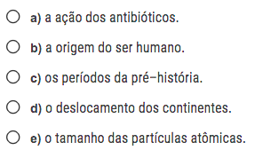

```{r setup, include=FALSE}
knitr::opts_chunk$set(
  echo = FALSE, warning = FALSE, message = FALSE,
  fig.width = 7, fig.height = 2.5, 
  fig.align='center'
)
options(htmltools.dir.version = TRUE)
```

```{r xaringan-tile-view, echo=FALSE}
xaringanExtra::use_tile_view()
```

```{r xaringan-scribble, echo=FALSE}
xaringanExtra::use_scribble()
```

```{r xaringan-panelset, echo=FALSE}
xaringanExtra::use_panelset()
```

background-image: url(https://www.coladaweb.com/wp-content/uploads/2014/12/20170629-cadeia-alimentar.png)
background-size: contain

---

background-image: url(https://microambiental.com.br/wp-content/uploads/2019/10/Bioacumulao-otmizada.jpg)
background-size: contain

---

background-image: url(https://static.biologianet.com/2020/05/biodiversidade-2.jpg)
background-position: 95% 50%

## Níveis de organização

.pull-left[
**População:** conjunto de organismos da <u>mesma espécie</u>.

**Comunidade:** conjunto de populações.

**Ecossistema:** interação de comunidades entre si e com fatores abióticos (temperatura, luz, umidade, pressão atmosférica, etc.)
]

---

class: inverse, center, middle

# Exerícios: fluxos de matéria e energia

---

background-image: url(figs/aulas_01_02/ex_01.png)
background-size: 60%
background-position: 5% 50%

---

background-image: url(figs/aulas_01_02/ex_01.png)
background-size: 60%
background-position: 5% 50%

.pull-right-1[
**Raciocínio:**

Fungo beneficia abelhas.

Logo, morte dos fungos reduziria a população de abelhas.

**Letra (D)**
]

---

background-image: url(figs/aulas_01_02/ex_02.png)
background-size: 60%
background-position: 5% 50%

---

background-image: url(figs/aulas_01_02/ex_02.png)
background-size: 60%
background-position: 5% 50%

.pull-right-1[
**Raciocínio:**

.green[Consumidor secundário: passarinho.]

Sem capim, gafanhotos não sobrevivem.

Sem gafanhotos, passarinhos não sobrevivem.

**Conclusão:** redução da população de passarinhos por efeito indireto da falta de capim.


**Letra (B)**
]

---

background-image: url(figs/aulas_01_02/ex_03.png)
background-size: 45%
background-position: 5% 50%

---

background-image: url(figs/aulas_01_02/ex_03.png)
background-size: 45%
background-position: 5% 50%

.pull-right[
**Raciocínio:**

Qual população **AUMENTA** quando não há ratos?

Sem ratos, populações que os consomem reduzem por falta de alimento.

Logo, **eliminamos coruja e raposa das alternativas**, pois essas populações diminuem.

Sem ratos, população do vegetal aumenta.

Vegetal é alimento para zebras. Com maior disponibilidade de alimentos, população de zebras aumenta.

**Letra (A)**
]

---

background-image: url(figs/aulas_01_02/ex_04.png)
background-size: 50%
background-position: 3% 50%

---

background-image: url(figs/aulas_01_02/ex_04.png)
background-size: 50%
background-position: 3% 50%

.pull-right[
**Raciocínio:**

Mercúrio (Hg) não é metabolizado - **bioacumulação ou magnificação trófica.**

Metais tóxicos se acumulam ao longo dos níveis tróficos.

Logo, quanto maior o nível trófico, maior a concentração de Hg.

**Letra (E)**
]

---

class: inverse, center, middle

# Exercícios: análise e interpretação de gráficos
### ou "Como resolver questões de Biologia sem saber nada de Biologia" `r emo::ji("thinking_face")`

---

background-image: url(figs/aulas_01_02/ex_05.png)
background-size: 60%
background-position: 5% 50%

---

background-image: url(figs/aulas_01_02/ex_05.png)
background-size: 60%
background-position: 5% 50%

.pull-right-1[
**Raciocínio:**

Para associar sintomas aos resultados, basta .green[comparar os valores obtidos com os valores de referência.]

Qual valor não está dentro do "normal"?

Número de **plaquetas** abaixo do limite mínimo ( $250.000/mm^3$ )

**Letra (A)**
]

---

background-image: url(figs/aulas_01_02/ex_06_p1.png)
background-size: 60%
background-position: 5% 50%

.pull-right-1[
```{r}

```
]

---

background-image: url(figs/aulas_01_02/ex_06_p1.png)
background-size: 60%
background-position: 5% 50%

.pull-right-1[
```{r}

```

**Raciocínio:**

Quanto maior a % de respostas certas, maior o compreendimento dos fatos.

Qual número é maior para norte-americanos que para brasileiros e europeus?

**Letra (A)**
]

---

background-image: url(figs/aulas_01_02/ex_07.png)
background-size: 60%
background-position: 5% 50%

---

background-image: url(figs/aulas_01_02/ex_07.png)
background-size: 60%
background-position: 5% 50%

.pull-right-1[
**Raciocínio:**

Analisando alternativas uma a uma:

Aumento do pH reduz a atividade da enzima. **(A)** incorreta.

O principal inibidor é o pH, pois a redução da atividade é mais drástica. **(B)** incorreta.

Em ambiente básico (pH > 7), a atividade da enzima é menor. Logo, precisamos de mais enzimas para suprir a baixa atividade.

Em ambiente básico, a enzima tem menor atividade. Logo, uma menor concentração de substrato é metabolizada.

**Letra (D)**
]

---

background-image: url(figs/aulas_01_02/ex_08.png)
background-size: 55%
background-position: 5% 50%

---

background-image: url(figs/aulas_01_02/ex_08.png)
background-size: 55%
background-position: 5% 50%

.pull-right-1[
**Raciocínio:**

A curva de maior inclinação representa um maior aumento.

**Letra (A)**
]


