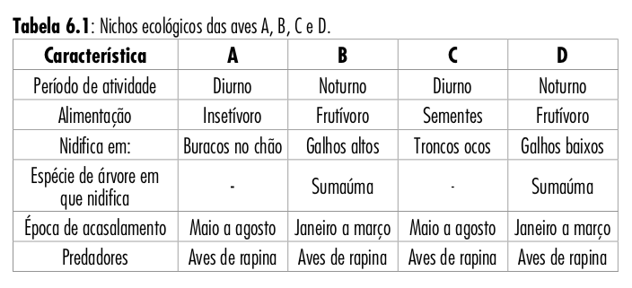
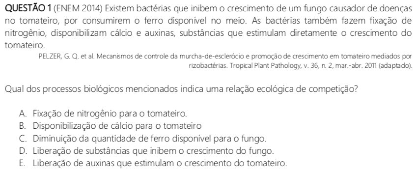
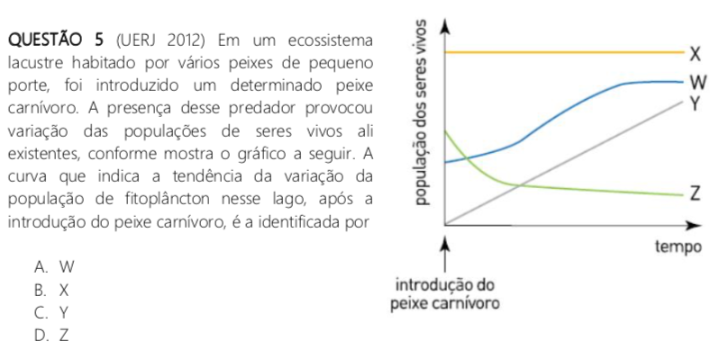
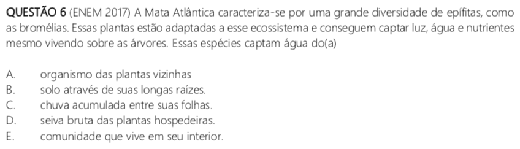
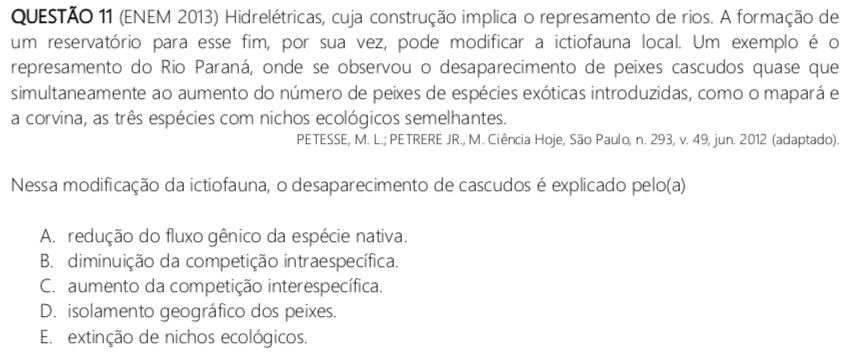

```{r setup, include=FALSE}
knitr::opts_chunk$set(
  echo = FALSE, warning = FALSE, message = FALSE,
  fig.width = 7, fig.height = 2.5, 
  fig.align='center'
)
options(htmltools.dir.version = TRUE)
```

```{r xaringan-tile-view, echo=FALSE}
xaringanExtra::use_tile_view()
```

```{r xaringan-scribble, echo=FALSE}
xaringanExtra::use_scribble()
```

```{r xaringan-panelset, echo=FALSE}
xaringanExtra::use_panelset()
```

## Conceitos de ecologia

<br />

.footnote[Fonte: Biologia PVS - Módulo 1 | biologiaempauta.com]

.pull-left-2[
**Hábitat:** local onde a espécie é encontrada.

**Nicho ecológico:** papel ecológico de uma espécie em relação ao seu ecossistema.

```{r}

```

]

.pull-right-1[
```{r out.width='120%'}
knitr::include_graphics("https://static.wixstatic.com/media/013f2f_7df5557a24ef452dbfe73db0433d5ead~mv2.png/v1/fill/w_268,h_280,al_c,lg_1,q_85/e7e09717de894a5c86094e432deafbd2-nicho%20e.webp")
```
]

---

## Relações ecológicas

<br />

Podem ser:

.pull-left[
- **Harmônicas:** benéficas para pelo menos uma das partes envolvidas.

- **Desarmônicas:** maléficas para pelo menos uma das partes envolvidas.
]

.pull-right[
- **Intraespecíficas:** entre indivíduos da mesma espécie.

- **Interespecíficas:** entre indivíduos de espécies diferentes.
]

---

## Relações ecológicas

.panelset.sideways[
.panel[.panel-name[Predatismo]
.pull-left[
- Interespecífica

- Desarmônica (+/-)

- Uma espécie se alimenta da outra.

- **Herbivoria:** animal se alimenta de plantas.
]
.pull-right[
```{r out.width='60%'}
knitr::include_graphics("https://static.wixstatic.com/media/013f2f_e0740fc4377147a59764bef4d54cd999~mv2.jpg/v1/fill/w_289,h_429,al_c,q_80,usm_0.66_1.00_0.01/013f2f_e0740fc4377147a59764bef4d54cd999~mv2.webp")

knitr::include_graphics("https://static.todamateria.com.br/upload/54/35/5435978db2860-predatismo.jpg")
```
]
]

.panel[.panel-name[Canibalismo]
.pull-left[
- Intraespecífica

- Desarmônica (+/-)

- Um indivíduo se alimenta de outro da mesma espécie.
]
.pull-right[
```{r}
knitr::include_graphics("https://upload.wikimedia.org/wikipedia/commons/thumb/f/f2/Praying_Mantis_Sexual_Cannibalism_European-37.jpg/1200px-Praying_Mantis_Sexual_Cannibalism_European-37.jpg")
```
]
]

.panel[.panel-name[Parasitismo]
.pull-left[
- Intraespecífica

- Desarmônica (+/-)

- Uma espécie se alimenta de recursos de outra espécie.
]
.pull-right[
```{r}
knitr::include_graphics("https://static.preparaenem.com/conteudo_legenda/c219a7cb309f4bdb5c218749c2b869d8.jpg")
```
]
]

.panel[.panel-name[Mutualismo]
.pull-left[
- Interespecífica

- Harmônica (+/+)

- Relação **obrigatória** que beneficia ambas as espécies.
]
.pull-right[
```{r out.width='90%'}
knitr::include_graphics("https://static.wixstatic.com/media/013f2f_017a2404514f47d8b2c37705cb6bb22d~mv2.jpg/v1/fill/w_392,h_341,al_c,lg_1,q_80/013f2f_017a2404514f47d8b2c37705cb6bb22d~mv2.webp")
knitr::include_graphics("https://conhecimentocientifico.r7.com/wp-content/uploads/2020/09/mutualismo-o-que-e-conceito-diferencas-e-exemplos-scaled-1024x659.jpeg")
```
]
]

.panel[.panel-name[Protocooperação]
.pull-left[
- Interespecífica

- Harmônica (+/+)

- Relação **facultativa** que beneficia ambas as espécies.
]
.pull-right[
```{r}
knitr::include_graphics("https://www.cartacapital.com.br/wp-content/uploads/2019/06/capivara-e-carrapateiro-1200x800.jpg")
knitr::include_graphics("https://i1.wp.com/biologo.com.br/bio/wp-content/uploads/2016/10/Protocoopera%C3%A7%C3%A3o.jpg")
```
]
]

.panel[.panel-name[Comensalismo]
.pull-left[
- Interespecífica

- Harmônica (+/0)

- Relação benéfica para uma espécie e neutra para outra.
]
.pull-right[
```{r}
knitr::include_graphics("https://static.wixstatic.com/media/013f2f_a44c3e70e365463488edf9ea31ed3ece~mv2.jpg/v1/fill/w_296,h_240,al_c,lg_1,q_80/013f2f_a44c3e70e365463488edf9ea31ed3ece~mv2.webp")
```
]
]

.panel[.panel-name[Inquilinismo]
.pull-left[
- Interespecífica

- Harmônica (+/0)

- Plantas que ficam apoiadas em árvores mais altas para obter mais luminosidade.
]
.pull-right[
```{r}
knitr::include_graphics("https://static.biologianet.com/conteudo/images/as-epifitas-usam-as-arvores-como-suporte-para-ter-um-maior-acesso-energia-luminosa-589849d56c249.jpg")
knitr::include_graphics("https://i.pinimg.com/originals/bc/43/0b/bc430b887744b191e725b7f8685e78e0.jpg")
```
]
]

.panel[.panel-name[Competição]
.pull-left[
- Intra ou interespecífica

- Desarmônica (-/-)

- Indivíduos competem por recursos e parceiros sexuais.
]
.pull-right[
```{r out.width='90%'}
knitr::include_graphics("http://3.bp.blogspot.com/-ObzrJ3iwKgA/TW1GsB4DN4I/AAAAAAAARJY/vFJgfBbk7OM/s1600/KLIMA%2BNATURALI%25E2%2584%25A2.png")
knitr::include_graphics("https://upload.wikimedia.org/wikipedia/commons/thumb/7/7f/Fighting_Hartebeest.jpg/1200px-Fighting_Hartebeest.jpg")
```
]
]

]

---

background-image: url(https://static.wixstatic.com/media/013f2f_7152fd43d3a043f4bae119f7e827b55f~mv2.png/v1/fill/w_742,h_520,al_c,q_90/RELA%C3%87%C3%95ES_ECOLOGICAS.webp)
background-size: contain

.footnote[Fonte: Biologia em Pauta]

---

class: inverse, center, middle

# Exercícios: conceitos de ecologia

---

background-image: url(figs/aulas_03_04/q1.png)
background-size: 60%
background-position: 5% 50%

---

background-image: url(figs/aulas_03_04/q1.png)
background-size: 60%
background-position: 5% 50%

.pull-right-1[
**Raciocínio:**

Os embriões da vespa se alimentam do conteúdo dos ovos da borboleta, como um parasita.

Logo, a vespa controla a população de borboletas.

**Letra (A)**
]

---

background-image: url(figs/aulas_03_04/q2.png)
background-size: 60%
background-position: 5% 50%

---

background-image: url(figs/aulas_03_04/q2.png)
background-size: 60%
background-position: 5% 50%

.pull-right-1[
**Raciocínio:**

O enunciado descreve o modo de vida do animal em relação ao seu ecossistema: **nicho ecológico**.

**Letra (A)**
]

---

background-image: url(figs/aulas_03_04/q3.png)
background-size: 60%
background-position: 5% 50%

---

background-image: url(figs/aulas_03_04/q3.png)
background-size: 60%
background-position: 5% 50%

.pull-right-1[
**Raciocínio:**

Para recuperar uma área desmatada, o ideal é uma espécie com alto potencial biótico e que produza muitos descendentes.

**Letra (C)**
]

---

background-image: url(figs/aulas_03_04/q4.png)
background-size: 45%
background-position: 5% 50%

---

background-image: url(figs/aulas_03_04/q4.png)
background-size: 45%
background-position: 5% 50%

.pull-right[
**Raciocínio:**

Para aumentar a população de graxains, devemos aumentar a população de presas ou reduzir a população de predadores.

**Letra (A)**
]

---

class: inverse, center, middle

# Exercícios: relações ecológicas

---

```{r out.width='80%'}

```

---

```{r out.width='80%'}

```

**Raciocínio:**

Competição por recursos (ferro).

**Letra (C)**

---

```{r out.width='80%'}

```

---

```{r out.width='80%'}

```

**Raciocínio:**

Com a introdução do peixe carnívoro, a população do peixe que se alimentava do fitoplâncton diminui.

Logo, a população do fitoplâncton aumenta, pois não há mais predator.

Entretanto, o crescimento de uma população é limitado pela quantidade de recursos no meio: nenhum crescimento é infinito.

**Letra (A)**

---

```{r out.width='80%'}

```

---

```{r out.width='80%'}

```

**Raciocínio:**

Plantas epífitas não usam os recursos da hospedeira (senão seria parasitismo). Como estão no alto, só podem usar a água da chuva.

**Letra (C)**

---

```{r out.width='80%'}

```

---

```{r out.width='80%'}

```

**Raciocínio:**

Com a introdução de espécies exóticas, houve competição por recursos.

**Letra (C)**

