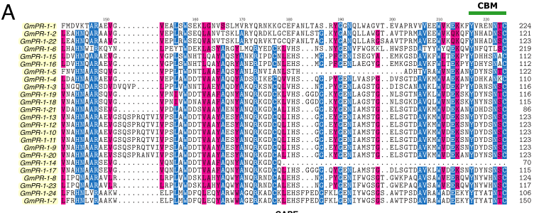

```{r setup, include=FALSE}
knitr::opts_chunk$set(
  echo = FALSE, warning = FALSE, message = FALSE,
  fig.width = 7, fig.height = 2.5, 
  fig.align='center', dpi = 300
)
options(htmltools.dir.version = TRUE)
```

```{r xaringan-tile-view, echo=FALSE}
xaringanExtra::use_tile_view()
```

```{r xaringan-scribble, echo=FALSE}
xaringanExtra::use_scribble()
```

```{r xaringan-panelset, echo=FALSE}
xaringanExtra::use_panelset()
```

background-image: url(https://static.preparaenem.com/conteudo_legenda/platao-esquerda-aristoteles-direita-em-recorte-plano-central-escola-atenas-pintura-renascentista-rafael-sanzio-5c87e2bb747da.jpg)
background-size: 60%
background-position: 50% 70%

## Fixismo: "as espécies não mudam"

---

background-image: url(https://escolaeducacao.com.br/wp-content/uploads/2020/02/girafa_lamarck.jpg)
background-size: 60%
background-position: 50% 85%

## Lamarckismo

<br />
Jean-Baptiste Lamarck foi o primeiro a propor que as espécies mudam com o tempo.

- Lei do uso e desuso: quanto mais usa-se um órgão, mais ele se desenvolve
- Transmissão de caracteres adquiridos: as mudanças ocorridas (por uso e desuso) são passadas à geração seguinte.

---

background-image: url(https://st2.depositphotos.com/2931363/6820/i/600/depositphotos_68200777-stock-photo-father-and-son-showing-biceps.jpg)
background-size: 50%
background-position: 50% 70%

## O erro de Lamarck #1

<br/>
Filhos de pessoas que praticam musculação nascem fortes?

---

background-image: url(https://s04.video.glbimg.com/x720/3276727.jpg)
background-size: 60%
background-position: 50% 70%

## O erro de Lamarck #2

<br />
Filhas de mulheres que usam alongador de pescoço nascem com pescoço maior?

---

## Darwin e a Teoria da Evolução

**Evolução: descendência com modificação**

Existe grande variabilidade em uma população. Na natureza, a forma mais adaptada de uma espécie tende a sobreviver, enquanto a menos adaptada morre (**seleção natural**).

```{r out.width='75%'}
knitr::include_graphics("http://noctulachannel.com/wp-content/uploads/2015/05/evolu%C3%A7%C3%A3o-do-pesco%C3%A7o-das-girafas.jpg")
```

---

background-image: url(https://2.bp.blogspot.com/-sVaCNDxA1UA/WD_9QzWSEUI/AAAAAAAAVQY/8VRBSvngiiwewJfIPOovrHZcjaCjoy51wCLcB/s1600/pepper_moth2.JPG)
background-size: 50%
background-position: 50% 80%

## As mariposas de Manchester

<br />

A forma mais adaptada (camuflagem) sobrevive e reproduz-se. Com o tempo, a população de mariposas será predominantemente escura, pois as brancas morreram.

---

background-image: url(https://i0.wp.com/darwin.bio.br/dnacetico/wp-content/uploads/2015/04/evohumana.jpg?ssl=1)
background-size: 60%
background-position: 50% 70%

## A evolução ocorre de forma ramificada (não linear)

---

background-image: url(https://upload.wikimedia.org/wikipedia/commons/thumb/7/70/Phylogenetic_tree.svg/langpt-340px-Phylogenetic_tree.svg.png)
background-size: 70%
background-position: 50% 70%

## A evolução ocorre de forma ramificada (não linear)

---

class: inverse, center, middle

# Evidências da evolução

.bold[FAME:]

Fósseis

Anatomia

Molecular

Embriologia

---

## Evidências da evolução: registro fóssil

Fósseis revelam as mudanças acontecendo em etapas, do estado ancestral ao estado mais recente.

```{r out.width='75%'}
knitr::include_graphics("https://cdn.kastatic.org/ka-perseus-images/85156f01ae80e3fc9480b1e421e6836dfd54e8b9.png")
```

---

## Evidências da evolução: registro fóssil


Fósseis revelam as mudanças acontecendo em etapas, do estado ancestral ao estado mais recente.

```{r out.width='50%'}
knitr::include_graphics("http://4.bp.blogspot.com/-YaGZkeZ2Bb0/UZuFJxCdgYI/AAAAAAAAAKc/4nerkrz0TqY/s1600/birdevolution.jpg")
```


---

## Evidências da evolução: anatomia comparada

<br />
Anatomia muito parecida para espécies muito diferentes.

**Única explicação razoável:** características derivam de um ancestral em comum (são homólogas).

```{r out.width='80%'}
knitr::include_graphics("http://www.educabras.com/media/emtudo_img/upload/_img/20141216_113441.gif")
```

---

## Órgãos análogos: parece, mas não é!

**Órgãos homólogos:** derivam de um ancestral em comum. Ex.: ossos do braço de mamíferos.

**Órgãos análogos:** têm função parecida, mas origens diferentes. Ex.: asa de morcego e de inseto.

```{r out.width='35%'}
knitr::include_graphics("https://escolaeducacao.com.br/wp-content/uploads/2016/10/asa-de-uma-ave-e-de-um-inseto.jpg")
```

---

## Evidências da evolução: semelhanças moleculares

<br />
Sequências de DNA (e de proteínas) muito parecidas entre espécies.

```{r}
knitr::include_graphics("https://docplayer.com.br/docs-images/57/40552018/images/61-0.jpg")
```

---

## Evidências da evolução: semelhanças moleculares

<br />
Sequências de DNA (e de proteínas) muito parecidas entre espécies.

```{r out.width='90%'}

```

---

## Evidências da evolução: semelhanças embriológicas

<br />
Desenvolvimento embrionário semelhante entre espécies diferentes.

```{r out.width='55%'}
knitr::include_graphics("https://escolaeducacao.com.br/wp-content/uploads/2020/03/desenvolvimentocordados.jpg")
```

---

class: inverse, center, middle

# Mas como surgem novas espécies?

---

## Especiação: surgimento de novas espécies

<br />
Para surgir novas espécies, grupos de uma população precisam ser **isolados reprodutivamente**.

**Conceito biológico de espécie:** indivíduos pertencem à mesma espécie se forem capazes de reproduzir e gerar descendentes férteis. Conceito simplificado, pois não se aplica a grupos como bactérias.

---

## Especiação alopátrica: isolamento por barreira geográfica

<br />
Após o isolamento, cada grupo vai evoluindo independentemente. Após centenas ou milhares de anos, os grupos estão tão diferentes que já não cruzam mais entre si.

```{r out.width='90%'}
knitr::include_graphics("http://s2.glbimg.com/KNZc7Y1eAtDegjY-AjVDwtuwzBs=/0x0:620x194/620x194/s.glbimg.com/po/ek/f/original/2014/10/30/especiacao_alopatrica.png")
```

---

## Especiação simpátrica: isolamento por nicho

Grupos passam a explorar outro nicho no mesmo ambiente. Após muitos anos, os nichos são tão diferentes que os grupos tornam-se espécies diferentes.

```{r out.width='80%'}
knitr::include_graphics("https://darwinianasdotcom.files.wordpress.com/2018/06/figura2.jpg?w=584")
```