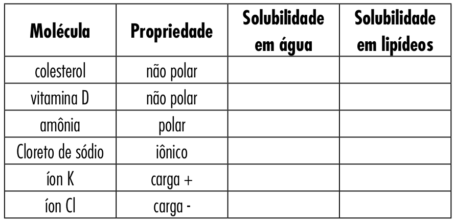
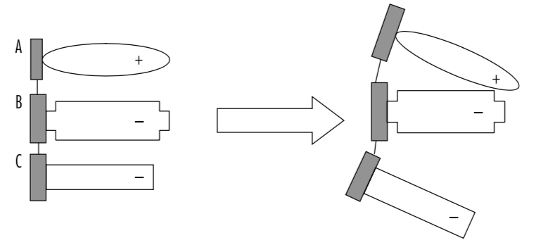
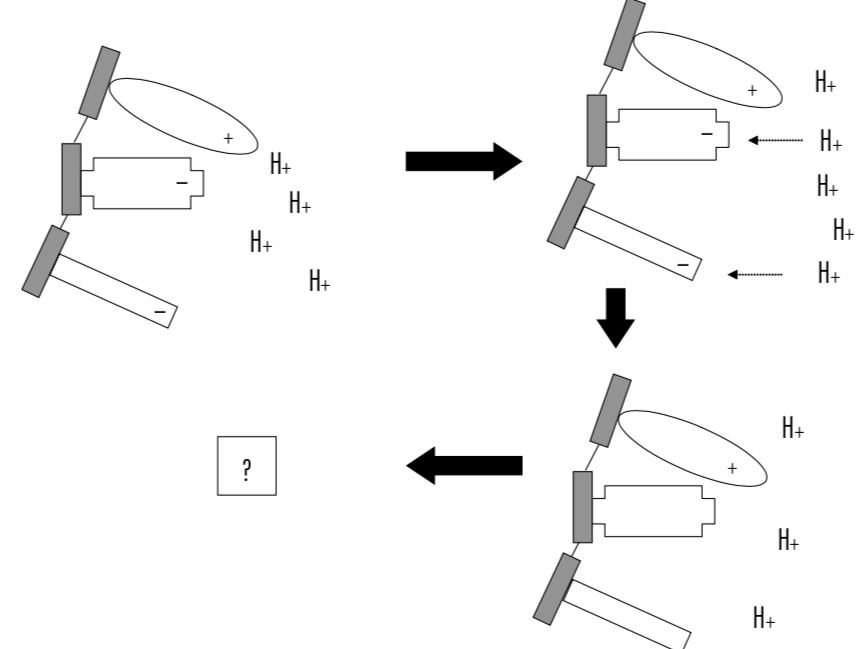
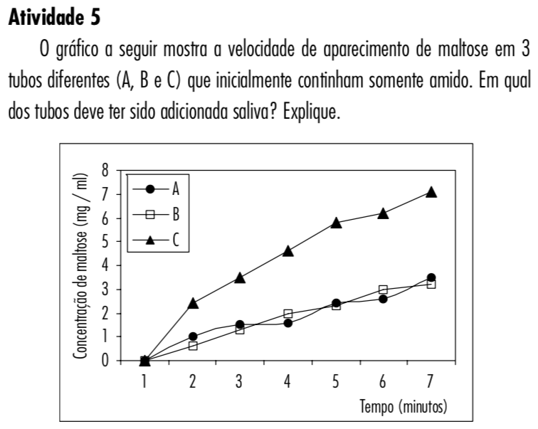
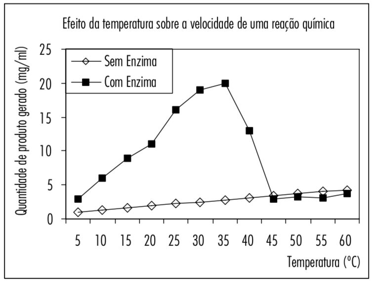

<style>
.title-slide {
  background-image: url(https://upload.wikimedia.org/wikipedia/commons/7/7a/Pyruvate_kinase_protein_domains.png);
  background-position: 90% 50%;
  background-size: 35%
}
</style>


```{r setup, include=FALSE}
knitr::opts_chunk$set(
  echo = FALSE, warning = FALSE, message = FALSE,
  fig.width = 7, fig.height = 2.5, 
  fig.align='center', dpi = 300
)
options(htmltools.dir.version = TRUE)
```

```{r xaringan-fit-screen, echo=FALSE}
xaringanExtra::use_fit_screen()
```

```{r xaringan-tile-view, echo=FALSE}
xaringanExtra::use_tile_view()
```

```{r xaringan-scribble, echo=FALSE}
xaringanExtra::use_scribble()
```

```{r xaringan-panelset, echo=FALSE}
xaringanExtra::use_panelset()
```

background-image: url(https://europa.com.br/blog/wp-content/uploads/2020/05/IMG_1498.jpg)
background-size: 35%
background-position: 95% 50%

## Polaridade das moléculas

<br />
Moléculas podem ser:

.pull-left-2[
- **polares:** interagem com água por ligações de hidrogênio;
- **apolares:** não interagem com água, pois não conseguem formar ligações de hidrogênio

Moléculas com cadeias carbônicas longas são apolares. Quanto mais carbonos, mais apolar.
]

---

## Exercício: polaridade

<br />
```{r out.width='80%'}

```

---

## pH: grau de acidez de uma solução

<br />
**pH**: potencial hidrogeniônico (concentração de $H^+$ numa solução)

- Alta concentração de $H^+$ &rarr; meio ácido &rarr; pH baixo
- Baixa concentração de $H^+$ &rarr; meio alcalino &rarr; pH alto

```{r out.width='80%'}
knitr::include_graphics("https://static.todamateria.com.br/upload/es/ca/escaladeph-cke.jpg")
```

---

## Simulação: efeito da diluição no pH

<iframe src="https://phet.colorado.edu/sims/html/ph-scale/latest/ph-scale_pt_BR.html" width="1100" height="550" scrolling="no" allowfullscreen></iframe>

---

background-image: url(https://upload.wikimedia.org/wikipedia/commons/7/7a/Pyruvate_kinase_protein_domains.png)
background-position: 95% 60%
background-size: 35%

## Proteínas: biomoléculas multifuncionais

<br />
Proteínas participam de todas (ou quase todas) as funções:  

- Estrutural
- Transporte
- Sinalização
- Hormônio
- Defesa
- Metabolismo energético
- Catalisadores (enzimas)
- Regulação da expressão gênica

 .bold[.font120[+]]

---

background-image: url(https://biologiaalemdosolhos.files.wordpress.com/2017/08/grupoaas.png?w=840)
background-size: 50%
background-position: 95% 60%

## Proteínas: polímeros de aminoácidos

.pull-left[
Estrutura padrão de aminoácidos:

- carbono central
- grupamento amino ( $-NH_3$ )
- grupamento carboxílico ( $-COOH$ )
- .red[grupo R]

A natureza química do grupo R determina a natureza química do aminoácido:
- apolar
- polar, não carregado
- carregado positivamente
- carregado negativamente
- aromático
]

---

## Aminoácidos são ligados por ligações peptídicas

<br/>
**Ligação peptídica:** condensação de OH (do $COOH$) + H (do $NH_3$), liberando $H_2O$.

<br />
```{r out.width='80%'}
knitr::include_graphics("http://1.bp.blogspot.com/-gZBZ5m2uTtE/VKZnnpmcWlI/AAAAAAAABco/hx_5xBAJezE/s1600/Liga%C3%A7%C3%A3o%2Bpept%C3%ADdica.gif")
```


`r emo::ji("exclamation")` **Cuidado:** depois de ligados por ligação peptídica, cada aminoácido passa a ser chamado "resíduo de aminoácido", pois perdeu um pedaço de seu esqueleto (ou $NH_3$ ou $COOH$).

---

## Após muitas ligações peptídicas, forma-se a proteína

<br />

```{r out.width="90%"}
knitr::include_graphics("https://nitrocdn.com/BzukxzxIDWSkBjOuXIuFVkjjEriFmqlw/assets/static/optimized/rev-5165cad/wp-content/uploads/2019/10/Polypeptide-Sequences.png")
```

---

## Como uma proteína se enovela?

<br />
O enovelamento das proteínas ocorre de acordo com as interações entre grupos R de cada resíduo e entre grupos R e o meio:
- cargas iguais se repelem / cargas diferentes se atraem.
- grupos apolares evitam o contato com água e se dobram para dentro.
- grupos polares podem formar ligações de hidrogênio.

```{r out.width='60%'}

```

---

## Das interações à estrutura terciária (3D)

.footnote[1YGP: Glicogênio-fosforilase]

```{r out.width='50%'}
knitr::include_graphics("https://proteopedia.org/wiki/images/d/d2/1ygp.gif")
```

---

## Influência do pH na estrutura da proteína

<br />
Como o pH é a concentração de $H^+$ no meio, esses prótons podem **desestabilizar grupos R carregados**. Por exemplo:

```{r out.width='55%'}

```

---

## Influência da temperatura na estrutura da proteína

<br />
Quanto maior a temperatura, maior o grau de agitação entre as moléculas. Temperaturas muito elevadas podem causar a **desnaturação** da proteína (perda da conformação nativa e perda de função).

<br />

```{r out.width='60%'}
knitr::include_graphics("https://miro.medium.com/max/1000/1*4DLBLXSFATmrqM2oNRBuUQ.gif")
```

.footnote[2CI2: Albumina do ovo]

---

## Enzimas: proteínas que aceleram reações químicas

<br />

```{r out.width='70%'}
knitr::include_graphics("https://beduka.com/blog/wp-content/uploads/2020/03/gr%C3%A1fico_de_rea%C3%A7%C3%A3o_e_concentra%C3%A7%C3%A3o_de_substrato_de_enzimas.gif")
```

---

## Como enzimas funcionam?

<br />
Substrato (reagente) se liga ao **sítio ativo** da enzima, catalisando (acelerando) a reação.

<br />

```{r out.width='70%'}
knitr::include_graphics("https://canvas.swansea.ac.uk/courses/20062/files/838238/preview?verifier=zolBlHpAOmKx2RdA2yXQNqhYpx8tRk28Oe0hfbZq")
```

---

## Como enzimas funcionam?

<br />
Substrato (reagente) se liga ao **sítio ativo** da enzima, catalisando (acelerando) a reação.

```{r out.width='40%'}
knitr::include_graphics("https://upload.wikimedia.org/wikipedia/commons/thumb/f/f5/Hexokinase_induced_fit.svg/1500px-Hexokinase_induced_fit.svg.png")
```

---

## Colocando em prática

```{r out.width='60%'}

```

---

## Cada enzima tem um pH ótimo

<br />
Como enzimas são proteínas (exceto ribozimas), suas atividades também são afetadas pelo pH.

<br />
```{r out.width='68%'}
knitr::include_graphics("https://s3.amazonaws.com/files-s3.iesde.com.br/resolucaoq/questao/2017_10_23_59ee28052eeac.png")
```

---

## Efeito da temperatura na atividade enzimática

<br />
```{r out.width='60%'}

```

---

## Consolidando: e se pudéssemos ver uma célula de perto?

<br />
```{r out.width='70%'}
knitr::include_graphics("https://cdn.cloudflare.steamstatic.com/steam/apps/1654050/ss_8f3dcb005667ef24a79e5f3f9c3459f657e9cd2d.600x338.jpg?t=1624925700")
```

.center[
[Clique aqui para ver a simulação](https://store.steampowered.com/app/1654050/Nanoscape/)
]

---

class: center, middle, inverse

# .orange[Resumo:]


### Proteínas são biomacromoléculas multifuncionais
### Proteínas são formadas por unidades menores - os aminoácidos
### Aminoácidos se unem por ligações peptídicas
### Enzimas são proteínas que aceleram reações químicas
### Temperatura e pH afetam a estrutura e função das proteínas


