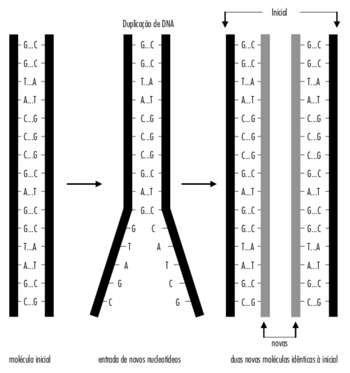

<style>
.title-slide {
  background-image: url(https://cdn.pixabay.com/photo/2019/03/08/20/37/dna-4043148_960_720.png);
  background-position: 96% 50%;
  background-size: 45%
}
</style>


```{r setup, include=FALSE}
knitr::opts_chunk$set(
  echo = FALSE, warning = FALSE, message = FALSE,
  fig.width = 7, fig.height = 2.5, 
  fig.align='center', dpi = 300
)
options(htmltools.dir.version = TRUE)
```

```{r xaringan-fit-screen, echo=FALSE}
xaringanExtra::use_fit_screen()
```

```{r xaringan-tile-view, echo=FALSE}
xaringanExtra::use_tile_view()
```

```{r xaringan-scribble, echo=FALSE}
xaringanExtra::use_scribble()
```

```{r xaringan-panelset, echo=FALSE}
xaringanExtra::use_panelset()
```

---

## Estrutura de ácidos nucleicos

<br />

```{r out.width='50%'}
knitr::include_graphics("https://conhecimentocientifico.r7.com/wp-content/uploads/2021/01/nucleotideos-o-que-sao-definicao-estrutura-e-acidos-nucleicos-960x739.png")
```

---

## Diferenças entre DNA e RNA


.pull-left[
.font120[.bgb[DNA]] <br />

Composto por:
- Fosfato
- Açúcar .bgb[(desoxirribose)]
- Base nitrogenada (A, .bgb[T], G ou C)

Dupla fita.

Molécula duradoura que contém toda a informação genética de um indivíduo.
]

.pull-right[
.font120[.bgr[RNA]] <br />

Composto por:
- Fosfato
- Açúcar .bgr[(ribose)]
- Base nitrogenada (A, .bgr[U], G, C)

Fita simples.

Molécula temporária, geralmente contém informação necessária para a síntese de uma proteína específica.
]

---

background-image: url(https://static.todamateria.com.br/upload/57/c3/57c3212ccf165-dna.jpg)
background-size: 45%
background-position: 95% 50%

## Estrutura do DNA

<br />
.pull-left[
AT: 2 ligações de H

GC: 3 ligações de H

<br />
Ligações de H são sempre mais difíceis de romper.

Sabendo que A pareia com T e G pareia com C, é possível calcular a frequência de cada base sabendo apenas a frequência de uma delas.

Exemplo: Uma sequência de 1000 nucleotídeos contém 200 adeninas (A). Qual é o número de T, G e C?
]

---

background-image: url(https://cdn1.byjus.com/wp-content/uploads/2019/01/Ribonucleic-Acid-RNA.png)
background-size: contain

---

background-image: url(http://www.infoescola.com/wp-content/uploads/2017/01/dogma-central-biologia-molecular2.jpg)
background-size: contain

## A lógica molecular da vida

---

## Duplicação do DNA

```{r out.width='80%'}
knitr::include_graphics("https://static.biologianet.com/2020/05/processo-de-replicacao.jpg")
```

A duplicação é .bgb[semi-conservativa]: novas moléculas de DNA são formadas a partir de **uma fita molde (original)** e **uma fita recém-sintetizada (nova)**. A enzima responsável por sintetizar a nova fita se chama **DNA polimerase**.

---

## Duplicação do DNA

```{r out.width='47%'}

```

---

## Transcrição do DNA em RNA

```{r out.width='60%'}
knitr::include_graphics("https://www.genome.gov/sites/default/files/tg/en/illustration/transcription.jpg")
```

A partir de uma das fitas do DNA, a enzima **RNA polimerase** sintetiza uma molécula de RNA.

---

## Exercício

<br />
Imagine que você é a RNA polimerase e transcreva a sequência de DNA abaixo:

<br />
.center[.font180[TACTAGAGCATTCTGACT]]

---

background-image: url(https://essaseoutras.com.br/wp-content/uploads/2011/09/tipos-de-rna.png)
background-position: 95% 50%
background-size: 40%

## Tipos de RNA

<br />
.pull-left[
De modo geral, existem 4 tipos de RNA:

1. **RNA mensageiro (RNAm):** contém a informação de um gene. Nele está a informação para produzir uma proteína específica (como uma receita de um bolo).

2. **RNA ribossômico (RNAr):** forma o ribossomo, estrutura que sintetiza proteínas.

3. **RNA transportador (RNAt):** transporta os aminoácidos para formar as proteínas. Cada RNAt se liga a um aminoácido.

4. **RNAs reguladores:** RNAs não-codificadores de proteínas, mas que regulam a expressão gênica ou a síntese de proteínas.

]

---

background-image: url(https://colegiovascodagama.pt/ciencias3c/onze/images/Imagem63.png)
background-position: 95% 50%
background-size: 45%

## Processamento de RNAm (splicing)

<br />
.pull-left[
Após a transcrição, o RNAm é formado por:

- **éxons:** regiões codificantes de proteína.

- **íntrons:** regiões não-codificantes de proteínas.

As regiões que não contêm informação para sintetizar proteínas (íntrons) são removidas. Esse processo se chama .bgb[splicing].

Após o .bgb[splicing], temos o **RNAm maduro**.
]

---

## Um mesmo gene pode dar origem a proteínas diferentes

```{r out.width='75%'}
knitr::include_graphics("https://cdn.kastatic.org/ka-perseus-images/679ee2337c1c125e33a3fb1d6e7164038e839945.gif")
```

Para RNAm com muitos éxons, os éxons usados no RNAm maduro podem variar, como se fosse uma brincadeira de montar peças de lego. Esse processo se chama **splicing alternativo**.

---

background-image: url(http://s3-sa-east-1.amazonaws.com/descomplica-blog/wp-content/uploads/2015/05/sintese_proteica.jpg)
background-position: 95% 50%
background-size: 45%

## Tradução: síntese de proteína a partir do RNAm

<br />
.pull-left[
Depois que o RNAm maduro sai do núcleo, o .bgb[ribossomo] se acopla ao RNAm e começa a sintetizar a proteína.

Para sintetizar a proteína, o ribossomo "lê" a mensagem no RNAm de 3 em 3 nucleotídeos.

Os conjuntos de 3 nucleotídeos se chamam .bgp[códon].

Cada .bgp[códon] recruta um RNAt ligado a um aminoácido específico. 

Para saber qual aminoácido está associado a cada .bgp[códon], basta olhar uma tabela chamada .bgr[código genético].
]

---

## O código genético

```{r out.width='70%'}
knitr::include_graphics("https://files.passeidireto.com/a6feaf57-050b-47d9-a878-4e48e6dc9cf8/a6feaf57-050b-47d9-a878-4e48e6dc9cf8.jpeg")
```

O código genético é **degenerado:** existe redundância, pois o mesmo aminoácido pode ser codificado por códons diferentes.

---

## O código genético é como um criptograma

```{r}
knitr::include_graphics("https://www.licaopratica.com.br/wp-content/uploads/2019/09/Criptograma-Modernismo-terceira-gera%C3%A7%C3%A3o-Li%C3%A7%C3%A3o-Pr%C3%A1tica-1.png")
```

---

background-image: url(http://midia.atp.usp.br/imagens/redefor/EnsinoBiologia/GenBio/genbio_sem06_1w.jpg)
background-position: 95% 65%
background-size: 40%

## Qual é a sequência da proteína formada pelo RNAm abaixo?

<br />
.font120[**RNAm:**

AUGUUAACGGGUCCAUACAAACGAGCC
]

---

background-image: url(https://www.blogs.unicamp.br/cdf/wp-content/uploads/sites/171/2021/01/traducao-1024x569.png)
background-size: contain

---

<iframe src="https://phet.colorado.edu/sims/html/gene-expression-essentials/latest/gene-expression-essentials_pt_BR.html"
        width="1100"
        height="600"
        allowfullscreen>
</iframe>